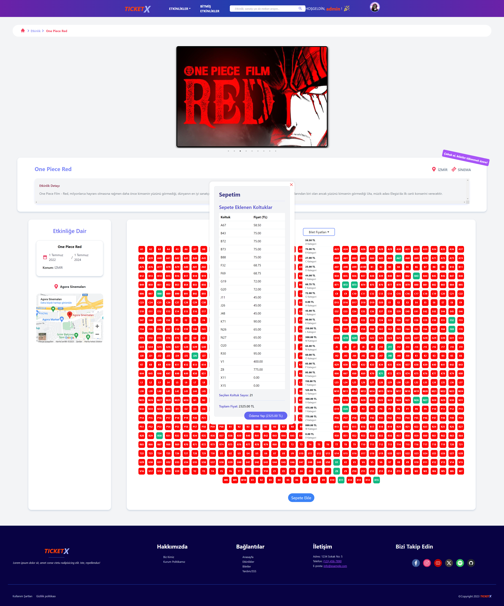
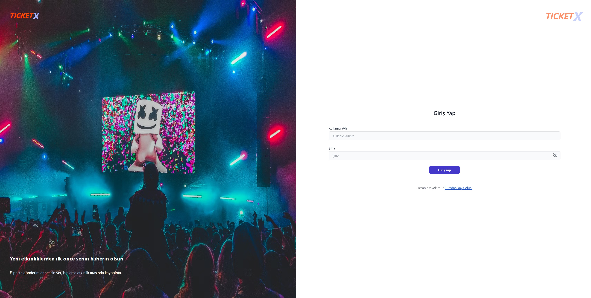
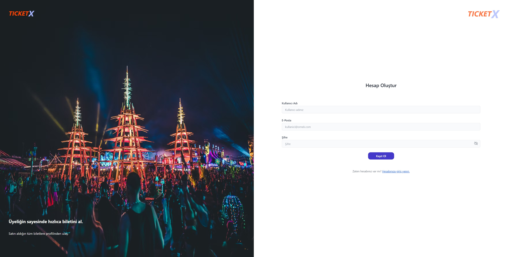

# Techcareer Bootcamp - Final Project

A quick overview of the final project of techcareer bootcamp; a simple clone of biletix (users can view events, access event details). In this project; React is used in the frontend, and Python's web framework Django is used in the backend, with SQLITE3 as the database.

**Note:** This project was developed collaboratively as a team effort. You can view the contributors from the Contributors section.

# Getting Started

- cd backend
- cd server
    - pip install -r requirements.txt
    - python manage.py runserver
- cd frontend
    - npm i
    - npm start

# Models

- **Users:**
    - **djoser:** Utilized Djoser package for user authentication and management.
    - **cors_headers:** Utilized Django CORS Headers for handling Cross-Origin Resource Sharing.
    - **auth:** Integrated Django's built-in authentication system for user authorization.

- **Category Model:**
    - **title** - Represents the title of a category.
    - **img_url** - Stores the URL for the category image.

- **SeatCategory Model:**
    - **seatClass** - Represents the class of a seat, usually a single character.
    - **totalSeat** - Indicates the total number of seats in this category.
    - **seatPrice** - Stores the price of each seat in this category.
    - **save** - Custom save method to create individual seat instances for this category upon creation.

- **Seat Model:**
    - **seatNumber** - Represents the seat number.
    - **seatCategory** - Represents the seat's category using a ForeignKey relationship.

- **Event Model:**
    - **name** - Represents the name/title of an event.
    - **location** - Represents the location of the event.
    - **locationUrl** - Stores the URL for the event location.
    - **owner** - Represents the owner/organizer of the event.
    - **description** - Describes the event briefly.
    - **category** - ForeignKey relationship to Category.
    - **isActive** - Indicates whether the event is active or not.
    - **start_date** - Date when the event starts.
    - **end_date** - Date when the event ends.
    - **seats** - ManyToMany relationship to Seat.
    - **eventImages** - ManyToMany relationship to EventImage.

- **EventImage Model:**
    - **image** - Stores the image for an event.

# Project Overview

- **Users:**
    - Users can register, login, and logout.
    - Users have the functionality to change their passwords.
    - User tokens are stored in the local storage upon login and are removed when the user logs out. There's no expiration time set for the token.

- **Event Listing:**
    - Users can view a list of available events.
    - Each event is displayed with its name, location, date, image and along with the active/inactive status.

- **Event Details:**
    - Clicking on an event allows users to access detailed information about that specific event.
    - Detailed information includes event name, location, date range, event category, description, owner, images of the event, seat classes, seat prices and the ability to filter the event.
    - Users can view expired events on the event list page or on the finished events page.

- **Event Categories:**
    - Events are categorized into different categories (e.g., cinemas, sports, arts).
    - Users can filter events based on these categories to find events of their interest.

- **Seat Selection (Ticketing System):**
    - For each event, users can select seats from different seat categories.
    - Available seats for an event are displayed and users can select seats from available options. Users can add seats to the cart, remove them from the cart and see the prices instantly.

- **Seat Pricing:**
    - Different seat categories have different prices.
    - Users can view the price associated with each seat category while selecting seats.

- **Event Location Map:**
    - Each event detail includes a map displaying the event's location.
    - Users can visualize the event's venue using the provided map.

- **Event Images:**
    - Events may have multiple images associated with them.
    - Users can view images related to the event to get a visual representation.

- **Active/Expired Events:**
    - Events are marked as active or expired based on their end dates.
    - Expired events are indicated to users, informing them that the event date has passed.

- **Search:**
    - Users can search by event name, event location, and event host. The results are listed.

# Project Note

This project is not a professional-grade work. Therefore, it lacks some functionalities and might contain errors. Feel free to reach out to me or any contributors involved in this project for contributions.

# Images

------------------------------------------------------------------------

------------------------------------------------------------------------

------------------------------------------------------------------------

------------------------------------------------------------------------

------------------------------------------------------------------------

